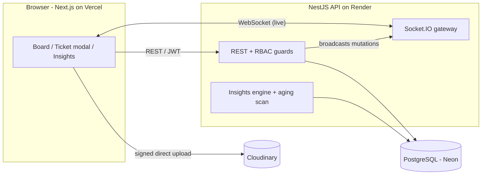

# kanflow

[](https://github.com/JITESH-003/kanflow/actions/workflows/ci.yml)

A real-time Kanban ticketing tool where **each team defines its own workflow**, work syncs **live** across everyone with no refresh, and a built-in **Flow Observability** dashboard tells you how work actually flows — where it stalls, how long it really takes, and when it'll be done.

Built end-to-end on free-tier infrastructure.

> **▶ Live demo:** [kanflow](https://kanflow-web-eight.vercel.app/) — click **"Explore the live demo"** (no signup). The demo workspace resets to a clean baseline on every visit.
> Manual login: `demo@kanflow.dev` / `demo12345`

---

## Why it's interesting

Most boards show you where tickets *are*. kanflow also tells you how work *flows*:

- **Flow Observability (the USP)** — the activity log is treated as an event stream and replayed into per-ticket stage timelines, then turned into real flow analytics: per-stage **p50/p90** cycle-time baselines, **throughput**, **WIP**, **flow efficiency**, a **Cumulative Flow Diagram**, automatic **bottleneck** detection, **aging-WIP** alerts, and a **Monte Carlo** delivery forecast ("85% chance the open work is done by Jul 3"). All hand-rolled — engine and SVG charts, no analytics SaaS, no chart library.
- **Configurable workflow engine** — stages are data, not hardcoded. Teams add / rename / reorder / delete columns and set field-lock and notification rules. The analytics stay correct across workflow edits because everything keys off stage IDs and is recomputed from events.
- **Real-time everything** — drag a card, leave a comment, change an assignee, and every connected client updates instantly, with live presence avatars on the board and in each ticket.

## Features

- 🔐 **Auth** — JWT access + refresh, bcrypt, rate-limited login/register
- 👥 **Teams & RBAC** — admin / manager / member / viewer, enforced by route guards
- 🧩 **Workflow engine** — per-team configurable stages + rules
- 🗂️ **Kanban board** — dnd-kit drag-and-drop with optimistic updates
- ⚡ **Real-time** — Socket.IO; REST is the source of truth, sockets push liveness
- 🔔 **Notifications** — watchers, assignment/aging alerts, live bell
- 📎 **Attachments** — signed browser-direct uploads to Cloudinary (files never touch the API), on tickets *and* comments
- 📊 **Flow Observability** — the analytics dashboard described above
- ✨ **Polish** — toasts, skeletons, empty states, keyboard shortcuts, error boundaries, one-click self-resetting demo

## Architecture



**Data flow:** REST mutations are the source of truth; after each write the API broadcasts over Socket.IO and clients invalidate their queries. Uploads are browser→Cloudinary direct (the API only signs and records metadata). Analytics are derived on demand from the immutable `ActivityLog`.

## Tech stack

| Layer | Choice |
|---|---|
| Frontend | Next.js 16 (App Router) · React 19 · TypeScript · Tailwind v4 · Framer Motion |
| Board / data | dnd-kit · TanStack Query · socket.io-client |
| Backend | NestJS 11 · TypeScript |
| Real-time | Socket.IO (JWT-authed handshake, room-based presence) |
| Database | PostgreSQL (Neon) · Prisma 7 with the `pg` driver adapter |
| Storage | Cloudinary (signed direct uploads) |
| Auth / security | JWT (access + refresh) · helmet · `@nestjs/throttler` |
| Charts | Hand-rolled SVG |
| Hosting | Vercel (web) · Render (api) · Neon (db) · Cloudinary (files) |

## Monorepo layout

```
apps/
  web/   Next.js frontend
  api/   NestJS backend (REST + WebSocket + Prisma)
packages/   (reserved for shared code)
render.yaml  Render blueprint for the API
```

## Local development

**Prerequisites:** Node ≥ 20, a PostgreSQL URL (a free Neon database works), and a free Cloudinary account.

```bash
# 1. install (npm workspaces)
npm install

# 2. configure environment (see below)

# 3. create the database schema + Prisma client
npm run build:api
( cd apps/api && npx prisma db push )

# 4. seed the demo workspace (optional, recommended)
npm run seed -w apps/api

# 5. run both apps
npm run dev:api    # http://localhost:3001
npm run dev:web    # http://localhost:3000
```

### Environment

`apps/api/.env`

```ini
DATABASE_URL="postgresql://...neon.tech/neondb?sslmode=require"
PORT=3001
WEB_ORIGIN="http://localhost:3000"
JWT_ACCESS_SECRET="..."
JWT_REFRESH_SECRET="..."
JWT_ACCESS_TTL="15m"
JWT_REFRESH_TTL="7d"
CLOUDINARY_CLOUD_NAME="..."
CLOUDINARY_API_KEY="..."
CLOUDINARY_API_SECRET="..."
```

`apps/web/.env.local`

```ini
NEXT_PUBLIC_API_URL="http://localhost:3001"
```

## Deployment

- **API → Render** (`render.yaml` blueprint): set the same `apps/api/.env` variables; Render's free tier supports WebSockets. `trust proxy` is enabled for correct client IPs behind the proxy.
- **Web → Vercel**: set `NEXT_PUBLIC_API_URL` to the Render URL.
- **DB → Neon**, **files → Cloudinary** (free tiers).

## Engineering notes

- **Event-sourced analytics** — nothing pre-aggregates "time in stage"; metrics are replayed from the `ActivityLog`, so a workflow change just recomputes correctly and any metric can be derived retroactively.
- **Probabilistic forecasting** — delivery dates come from a 5,000-run Monte Carlo bootstrap over historical daily throughput, reported as 50/85/95% confidence — not a single fake estimate.
- **Signed direct uploads** — the API issues a short-lived Cloudinary signature; the browser uploads the bytes directly, keeping the free API server light.
- **Self-resetting demo** — logging in as the demo account reseeds its workspace to a clean baseline, so every visitor starts fresh regardless of what the last one did.
- **CI** — every push / PR typechecks and builds both apps via GitHub Actions.
